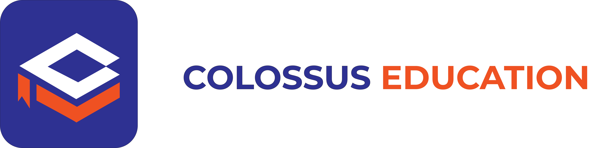

## Example GIF

# Colossus Education

Welcome to Colossus Education - your go-to platform for comprehensive IT training and education!

## Overview
Colossus Education is an online platform dedicated to providing high-quality IT training courses for individuals looking to enhance their skills and knowledge in various technology domains.

## Features
- **Wide Range of Courses:** Explore a diverse selection of IT courses covering topics such as programming languages, web development, cybersecurity, cloud computing, and more.
- **Expert Instructors:** Learn from industry professionals with extensive experience in their respective fields.
- **Interactive Learning:** Engage with interactive learning materials, quizzes, and projects to reinforce your understanding.
- **Flexible Learning:** Access courses anytime, anywhere, and learn at your own pace.
- **Certification:** Earn certificates upon course completion to validate your skills and enhance your resume.

## Getting Started
1. **Visit our Website:** Head over to (https://www.colossusedu.com) to explore our course catalog and offerings.
2. **Enroll for a Course:** Sign up for an account to enroll in courses and track your progress.
3. **Browse Courses:** Browse through our courses and choose the ones that align with your learning goals.
4. **Start Learning:** Dive into your selected course materials and begin your learning journey!

## Contributing
We welcome contributions from the community to enhance ColossusEDU. If you're interested in contributing, please refer to our [Contribution Guidelines](CONTRIBUTING.md).

## Support
For any questions, issues, or feedback, please contact our support team at support@colossusedu.com.

## License
This project is licensed under the [MIT License](LICENSE).

